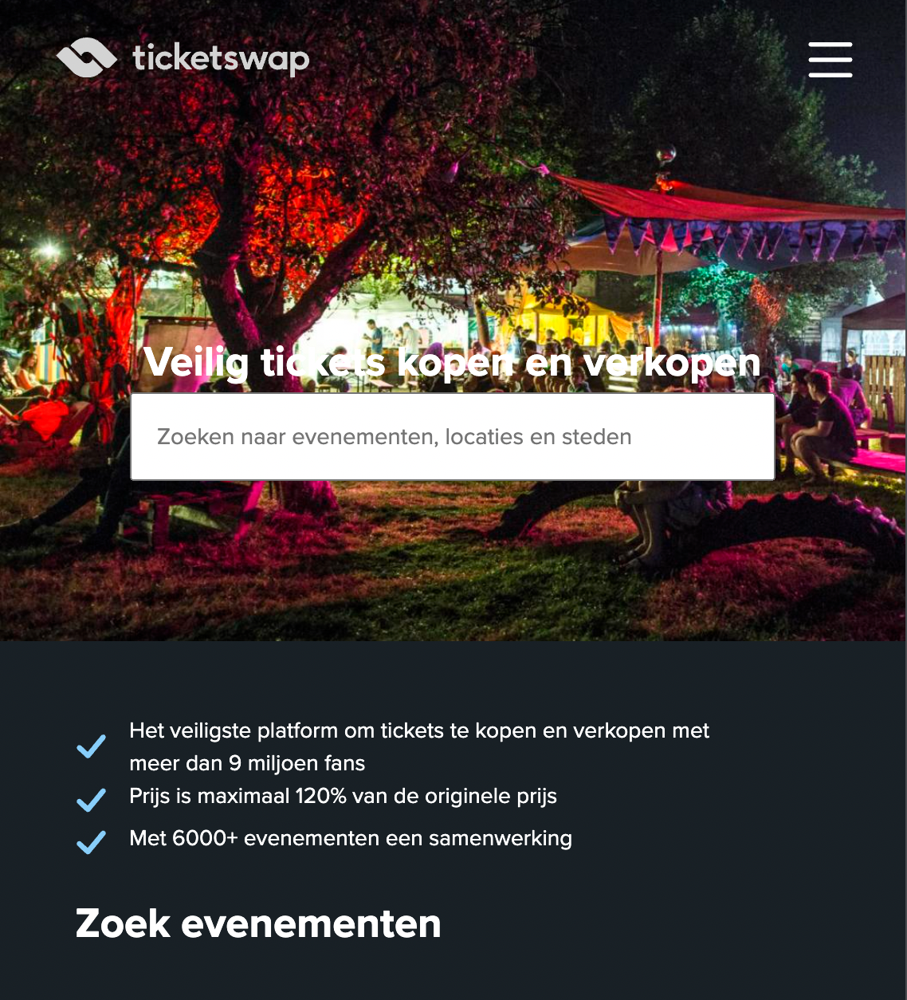
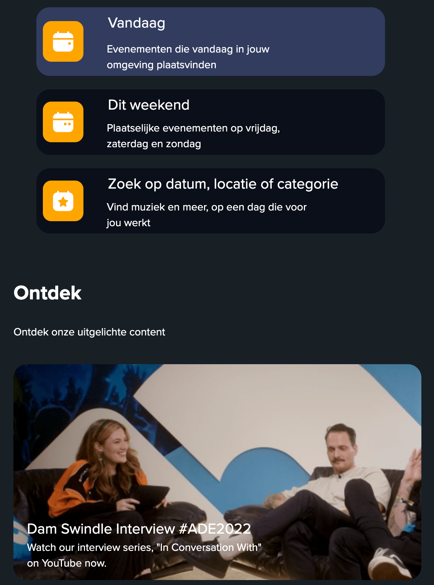
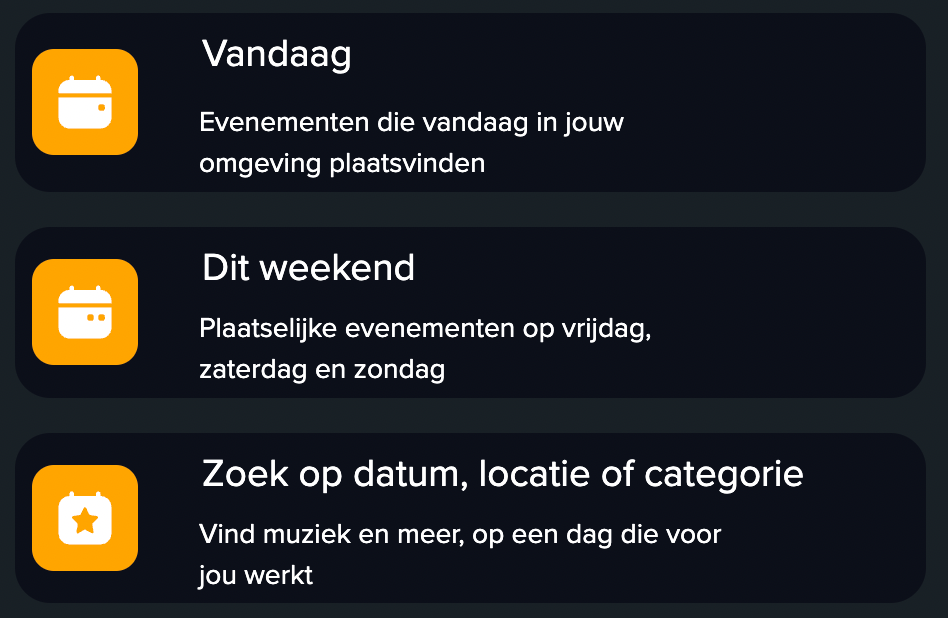

# Procesverslag
Markdown is een simpele manier om HTML te schrijven.  
Markdown cheat cheet: [Hulp bij het schrijven van Markdown](https://github.com/adam-p/markdown-here/wiki/Markdown-Cheatsheet).

Nb. De standaardstructuur en de spartaanse opmaak van de README.md zijn helemaal prima. Het gaat om de inhoud van je procesverslag. Besteedt de tijd voor pracht en praal aan je website.

Nb. Door *open* toe te voegen aan een *details* element kun je deze standaard open zetten. Fijn om dat steeds voor de relevante stuk(ken) te doen.

## Jij

  
uitwerken voor kick-off werkgroep

  ### Auteur:
  Sanne 't Hooft (vervangen door jouw naam)

  #### Je startniveau:
  hier je startniveau (kies uit zwart, rood óf blauw)

  #### Je focus:
  hier je focus (kies uit responsive óf surface plane)
 

## Je website

  
uitwerken voor kick-off werkgroep

  ### Je opdracht:
  link naar de website die je gaat namaken óf de naam/omschrijving van je eigen ontwerp

  #### Screenshot(s) van de eerste pagina (small screen): 
  hier de naam van de pagina  
  

  #### Screenshot(s) van de tweede pagina (small screen):
  hier de naam van de pagina  
  
 

## Toegankelijkheidstest 1/2 (week 1)

  
uitwerken na test in 1e werkgroep

  ### Bevindingen
  Lijst met je bevindingen die in de test naar voren kwamen:

  #### Screenreader
  Hier korte omschrijving (met indien nodig afbeeldingen)

  Hier een omschrijving van hoe het opgelost kan worden (met indien nodig afbeeldingen)

  #### Muis en Toetsenbord 
  Hier korte omschrijving (met indien nodig afbeeldingen)

  Hier een omschrijving van hoe het opgelost kan worden (met indien nodig afbeeldingen)

  #### Motoriek (shocks, elastiekjes)
  Hier korte omschrijving (met indien nodig afbeeldingen)

  Hier een omschrijving van hoe het opgelost kan worden (met indien nodig afbeeldingen)

  #### Visueel (brillen, contrast, kleurenblind, dark/light). 
  Hier korte omschrijving (met indien nodig afbeeldingen)

  Hier een omschrijving van hoe het opgelost kan worden (met indien nodig afbeeldingen)

## Breakdownschets (week 1)

  
uitwerken na afloop 2e werkgroep

  ### de hele pagina: 
  

  ### dynamisch deel (bijv menu): 
  

  ### wellicht nog een dynamisch deel (bijv filter): 
  

## Voortgang 1 (week 2)

  
uitwerken voor 1e voortgang

  ### Stand van zaken
 Begonnen met HTML, website blijkt toch meer uitdagend dan ik zelf dacht. Zit te twijfelen om toch nog te wisselen van site.

  ### Agenda voor meeting
  samen met je groepje opstellen

  | idelene        | Menno Leurs          | student 3    | student 4        |
  | ---            | hoe gaat scalability? | ---          | ---              |
  |vraag over dit |Hoever ben je met je site | en ik dit| en dan ik dat    |
  | en over dat    | dit als er tijd is | nog een punt | dit wil ik zeker |
  | ...            | ...                | ...          | ...              |

  ### Verslag van meeting
  hier na afloop snel de uitkomsten van de meeting vastleggen

  - punt 1
  - punt 2
  - nog een punt
  - ...

## Voortgang 2 (week 3)

  
uitwerken voor 2e voortgang

  ### Stand van zaken
  Tijd steken in FED ging goed, positioneren vond ik lastig en responsive maken ook.

  ### Agenda voor meeting
  samen met je groepje opstellen

  -responsiveness, positioneren in blocks
  -tijd steken in FED
  -hulp vragen
  -hamburger-menu 
  -hidden functions/JS
  -draggable carroussel 

  vragen:
  kleuren section 3 icons fixen
  div weghalen section 3
  menu foldout maken
  

  ### Verslag van meeting
  hier na afloop snel de uitkomsten van de meeting vastleggen

  - valt nog veel te doen  
  - sommige lopen nog tegen dingen aan
  - nog een punt
- ...

## Toegankelijkheidstest 2/2 (week 4)

  
uitwerken na test in 8e werkgroep

  ### Bevindingen
 -kleine hamburger button tijdens parkinson test
 -contrast goed ook al is het een dark theme website
 -website nog steeds goed te gebruiken met elastiekjes

  #### Screenreader
goede headings, alleen form lastig toegankelijk met screenreader

  Hier een omschrijving van hoe het opgelost kan worden (met indien nodig afbeeldingen)

form button verstoppen 
  #### Muis en Toetsenbord 
 site goed bereikbaar met toetsenbord en muis

  Hier een omschrijving van hoe het opgelost kan worden (met indien nodig afbeeldingen)

  #### Motoriek (shocks, elastiekjes)
  hamburger menu button lastig te klikken met parkinson

  Hier een omschrijving van hoe het opgelost kan worden (met indien nodig afbeeldingen)
grotere menu knop

  #### Visueel (brillen, contrast, kleurenblind, dark/light). 
  Hier korte omschrijving (met indien nodig afbeeldingen)
website is nog steeds goed te gebruiken met kleurenblindfilters
alleen kleine items zijn moeilijk te vinden met de tunnelvisiebril 
  Hier een omschrijving van hoe het opgelost kan worden (met indien nodig afbeeldingen)

## Voortgang 3 (week 4)

  
uitwerken voor 3e voortgang

  ### Stand van zaken
  Loop vaak tegen dingen aan waardoor ik niet verder kan gaan. Moet meer hulp vragen en eigenlijk wil ik continu vragen stellen. Door google kom ik soms toch verder.

  vragen:
  form groter maken
  text in plaatjes gaan niet automatisch inspringen
  section 3 boxes willen niet goed scalen (nu mediaport gebruikt)
  random ruimte en pagina kan naar rechts scrollen 
  alle sections responsive maken met zelfde margin links en rechts

  ### Agenda voor meeting
  samen met je groepje opstellen

  | student 1      | student 2          | student 3    | student 4        |
  | ---            | ---                | ---          | ---              |
  | dit bespreken  | en dit             | en ik dit    | en dan ik dat    |
  | en dat ook nog | dit als er tijd is | nog een punt | dit wil ik zeker |
  | ...            | ...                | ...          | ...              |

  ### Verslag van meeting
  hier na afloop snel de uitkomsten van de meeting vastleggen

  - punt 1
  - punt 2
  - nog een punt
  - ...

## Eindgesprek (week 5)

  
uitwerken voor eindgesprek

  ### Je uitkomst - karakteristiek screenshots:
  
  

  ### Dit ging goed/Heb ik geleerd: 
  Ik heb tijdens dit vak heel veel geleerd, helaas ging er alsnog veel fout
  ik heb geleerd gebruik te maken van mediaqueries, grid, een veel diepere sprong in flexbox en javascript combineren met html/css. Het gebruiken van grid begon lastig maar met wat hulp kwam ik er uit en zag ik hoeveel je er mee kon doen. Ook dingen zoals emmet en de mogelijkheden hiermee vond ik fascinerend.
  In het plaatje zie je hoe ik met grid 3 boxes heb gemaakt en het logo links en de tekst rechts. Dit was moelijker dan het eruit zag!

  

  ### Dit was lastig/Is niet gelukt:
  Helaas is de website half af en zijn er veel dingen wat niet is gelukt.
  Het hamburger menu in orde krijgen bijvoorbeeld, het positioneren van de li in de nav en ervoor zorgen dat het bij een bepaald breakpoint weer tevoorschijn kwam boven aan de pagina leek wel onmogelijk. Ook kwam ik er op het einde achter dat ik de responsiveness verkeerd heb bekeken in de browser en mn hele site is dus blijkbaar links uitgelijnd. Ik hoop dat iemand me uit het diepe wilt trekken met wat goede feedback waardoor ik bij de herkansing een voldoende kan halen!

  

## improvements herkansing jaar 2

Aangezien dit vak niet af was voor vorig jaar heb ik de volgende dingen gefixed:

meer gelet op responsiveness
pop out menu gefixed en animatie toegevoegd
flex op veel plekken opgegeven en opnieuw geschreven met grid
minder letten op precies namaken en gaan voor dingen responsive maken
pagina 2 verder afgemaakt, hierbij ook meer sections gaan nesten, wat het responsive maken een stuk makkelijker maakte
gelet op toegankelijkheid (visually hiding things, span, duidelijke alt, alles een naam geven)

## Bronnenlijst

  
continu bijhouden terwijl je werkt

  Nb. Wees specifiek ('css-tricks' als bron is bijv. niet specifiek genoeg).

  1. codepen 2 uitwerkingen (fold out menu)
  2. svg'tjes van ticketswap.nl
  3. ...

